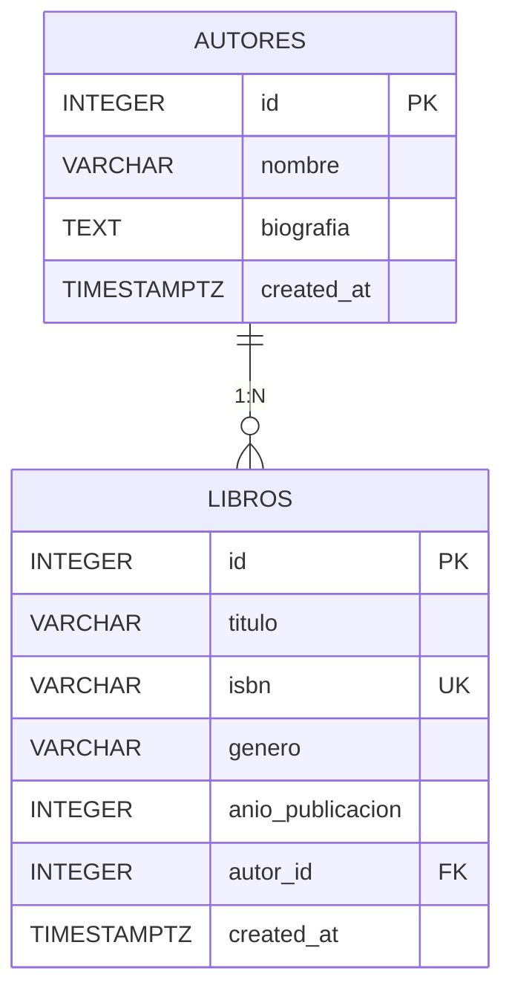

## Autor

Tabla SQL: `autores`.

| Campo | Tipo | Null | Notas |
|---|---|---|---|
| `id` | `INTEGER` | NO | PK autoincremental |
| `nombre` | `VARCHAR(150)` | NO | Obligatorio |
| `biografia` | `TEXT` | SÍ | Opcional |
| `created_at` | `TIMESTAMPTZ` | NO | Default `NOW()` |

## Libro

Tabla SQL: `libros`.

| Campo | Tipo | Null | Notas |
|---|---|---|---|
| `id` | `INTEGER` | NO | PK autoincremental |
| `titulo` | `VARCHAR(200)` | NO | Obligatorio |
| `isbn` | `VARCHAR(50)` | NO | **UNIQUE** |
| `genero` | `VARCHAR(100)` | NO | Filtrable case-insensitive |
| `anio_publicacion` | `INTEGER` | SÍ | Opcional |
| `autor_id` | `INTEGER` | NO | **FK** → `autores.id` (RESTRICT) |
| `created_at` | `TIMESTAMPTZ` | NO | Default `NOW()` |

## Relación

Un autor tiene **muchos** libros; un libro pertenece a **un** autor.



```js
Autor.hasMany(Libro, {
  foreignKey: "autor_id",
  as: "libros",
  onDelete: "RESTRICT",
});

Libro.belongsTo(Autor, {
  foreignKey: "autor_id",
  as: "autor",
});
```

> Con `onDelete: RESTRICT` no se puede eliminar un autor con libros. Primero borra (o reasigna) sus libros.
